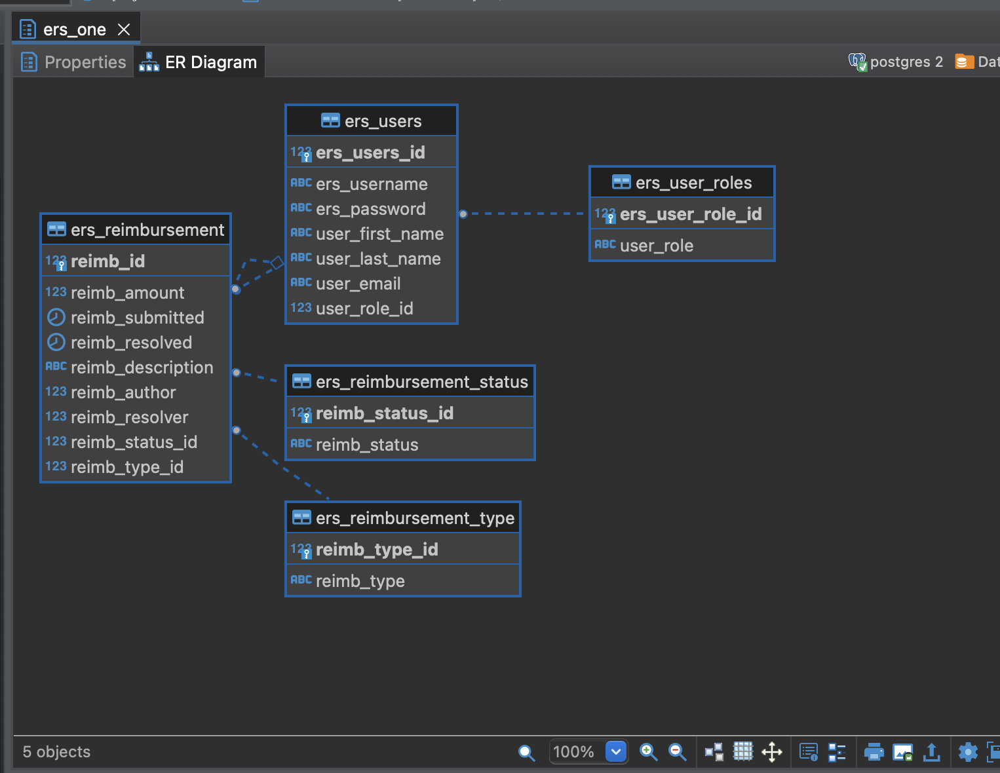
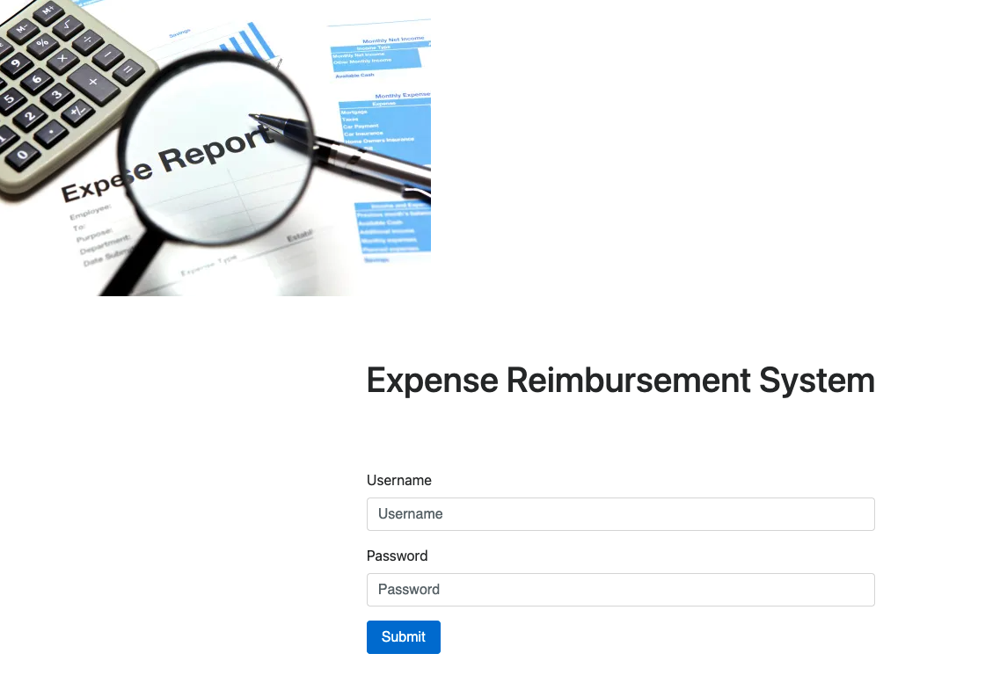
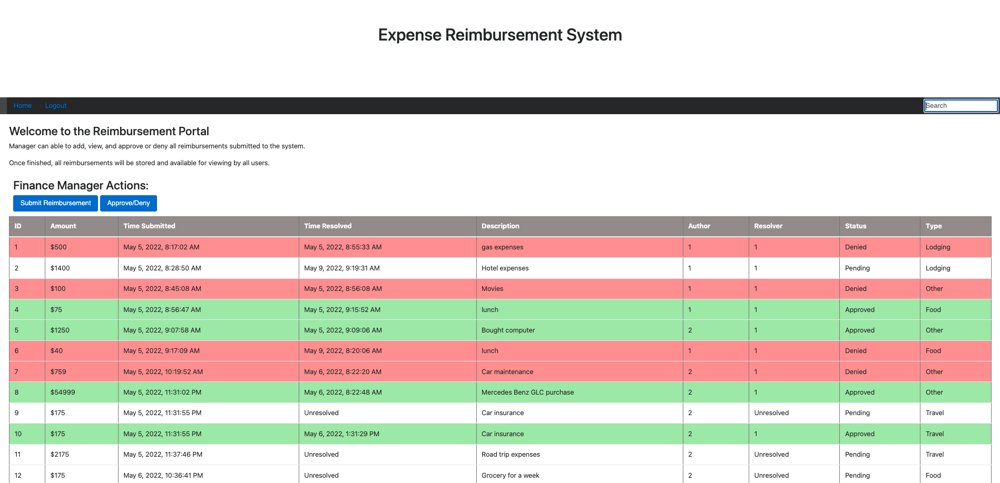
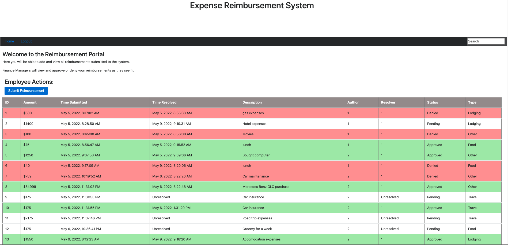
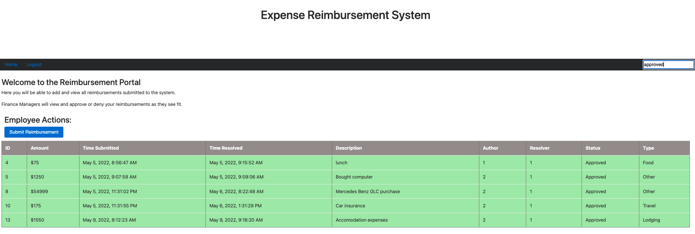
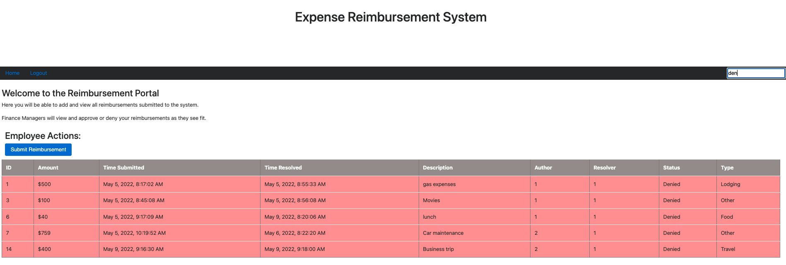

# Expense Reimbursment System (ERS)

The Expense Reimbursement System (ERS) will manage the process of reimbursing employees for expenses incurred while on company time. All employees in the company can login and submit requests for reimbursement and view their past tickets and pending requests. Finance managers can log in and view all reimbursement requests and past history for all employees in the company. Finance managers are authorized to approve and deny requests for expense reimbursement.

# Technologies Used
* Spring Tool Suite IDE
* Core Java - version 17.0.1
* HTML/CSS/Javascript
* Bootstrap
* JDBC
* Javalin - version 4.4
* Gson - version 2.8
* JUnit - version 5.8
* DBeaver - version 22.0.2
* PostgreSQL - version 42.3
* Maven - version 1.8
* AWS RDS

# Features
* User login
* Submit Request
* Create Reimbursement
* Review Pending Request
* View Past Tickets
* Approve or Deny Reimbursement(Manager only)

# Stretch Goals
- Postgres Database shall be hosted remotely on an AWS RDS
- Employee must select the type of reimbursement as: LODGING, TRAVEL, FOOD, OR OTHER.

# Getting Started
Note: You will need to install Java 8 or above
* From terminal, cd to directory where project will be located
* git clone repository https://github.com/brabin10/Project1/tree/main/ERSProject
* git pull

# Environment Setup:
* Create an AWS account and set up RDS(free version)
* Create  a database that utilizes postgreSQL(DBeaver for server side)
* Open the project in any IDE
* Run Launcher.java
* Navigate to http://localhost:9898/ in any web browser
* Recommend using postman for testing the endpoints to see it fully functional
* Enjoy!

# Use Case

# Activity

# ERD

# Login Page

# Finance Manager

# Employee Dashboard

# Contributor
Rabin Basnet
# License
Licensed under the [MIT License](LICENSE)

